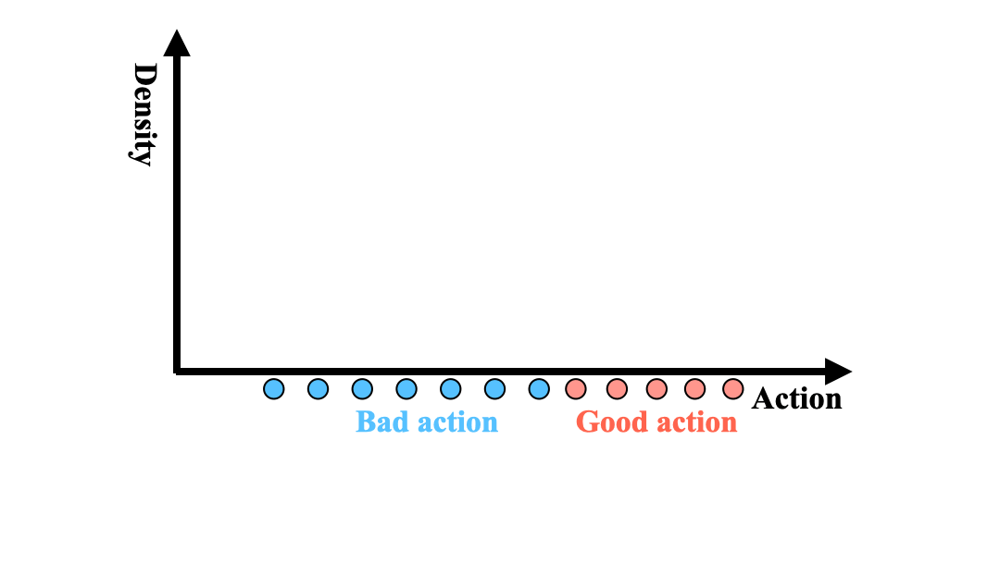

# Beyond Uniform Sampling: Offline Reinforcement Learning with Imbalanced Datasets
Official implementation of NeurIPS'23 paper, [Beyond Uniform Sampling: Offline Reinforcement Learning with Imbalanced Datasets](https://openreview.net/pdf?id=TW99HrZCJU)

**Abstract:** Offline policy learning is aimed at learning decision-making policies using existing
datasets of trajectories without collecting additional data. The primary motivation
for using reinforcement learning (RL) instead of supervised learning techniques
such as behavior cloning is to find a policy that achieves a higher average return
than the trajectories constituting the dataset. However, we empirically find that
when a dataset is dominated by suboptimal trajectories, state-of-the-art offline RL
algorithms do not substantially improve over the average return of trajectories in
the dataset. We argue this is due to an assumption made by current offline RL
algorithms of staying close to the trajectories in the dataset. If the dataset primarily
consists of sub-optimal trajectories, this assumption forces the policy to mimic the
suboptimal actions. We overcome this issue by proposing a sampling strategy that
enables the policy to only be constrained to “good data" rather than all actions in the
dataset (i.e., uniform sampling). We present a realization of the sampling strategy
and an algorithm that can be used as a plug-and-play module in standard offline
RL algorithms. Our evaluation demonstrates significant performance gains in 72
imbalanced datasets, D4RL dataset, and across three different offline RL algorithms.



# Installation

## Docker
WIP

## Local
- Install `python>=3.8` or using `conda`
- Install [suboptimal_offline_datasets](https://github.com/williamd4112/suboptimal_offline_datasets)
- pip install -r requirements.txt
- Install customized `d3rlpy` (only required for TD3BC):
```bash
cd TD3BC/d3rlpy
pip install -e .
```

# Usage
Setup local dependencies by running `source setup.sh` and then launch the experiments using the scripts in `experiments`. The experiment launching scripts are structured in the following ways
```bash
- ./experiments # all experiment launching scripts
  - d4rl # all experiment launching scripts for D4RL datasets
    - run_cql.py # CQL experiments
    - run_iql.py # IQL experiments
    - run_td3bc.py # TD3BC experiments
```
You may launch an experiment by the following command:
```bash
python experiments/d4rl/run_{cql | iql | td3bc}.py --mode {mode} --gpus {GPU ID list} --n_jobs {Number of parallel jobs}
```
The above command generates a bunch of jobs and each job consists of multiple commands to run the experiments on the devices you specify. 
The following explains the the purpose of each argument:
- `--mode`: Each launching script generates the commands to run each experiment. You may choose the `mode` among the following options to execute the commands:
    - `local`: Execute each job in the local session.
    - `screen`: Exceute each job in new screen session
    - `sbatch`: Execute each job in an `sbatch` job submission (You may need to customize Slurm job template for your cluster in `experiment/__init__.py`. See `SUPERCLOUD_SLURM_GPU_BASE_SCRIPT` in `experiment/__init__.py`).
    - `bash`: Only generate bash commands of running experiments. This is useful when you want to dump the commands and customize them for small experiments. Suggest using this with redirection (e.g., `python experiments/d4rl/run_cql.py --mode bash --gpus 0 > commands.sh`)
    - `gcp`: Launch job on GCP with [`jaynes`](https://github.com/geyang/jaynes-starter-kit). Note that I have not been maintaining this feature for a while. You may need to figure out the configuration details.
- `--gpus`: A list of GPU IDs you would like to run jobs. For example, if you want to run jobs on GPUs 0, 1, 2, 3, and 4, then you should use `--gpus 0 1 2 3 4` and the jobs will be evenly distributed on those GPUs.
- `--n_jobs`: Number of jobs executed in parallel. Each job consists of multiple commands that will be executed sequentially. 

# Reproduced experimental results with this public codebase
WIP

